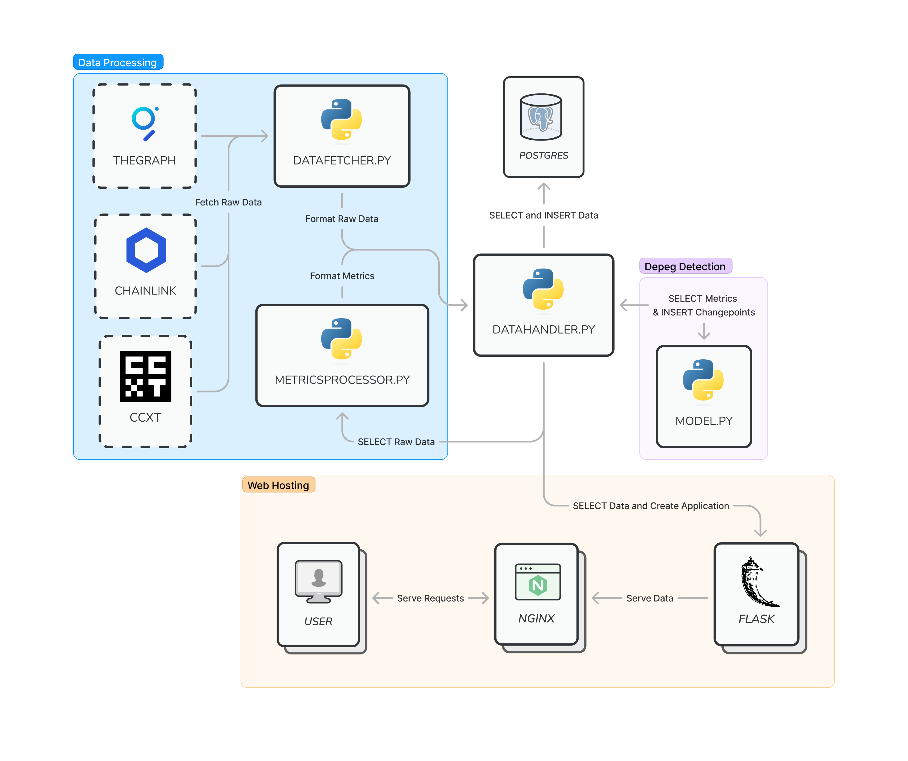
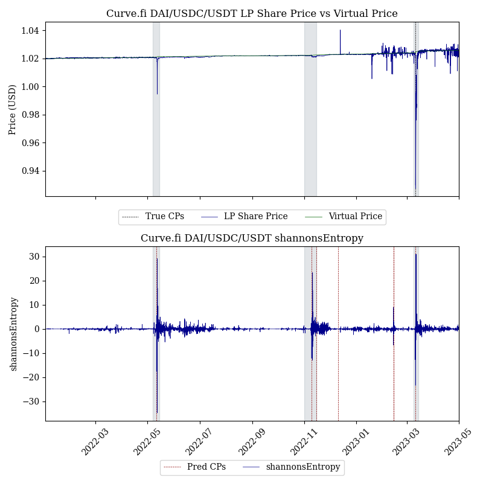

# Curvemetrics

Welcome to Curvemetrics, a stablecoin and liquid staking derivative depeg detector for Curve's StableSwap pools. Curvemetrics consists of two primary components:

1. **Metrics** - Our metrics are designed to capture *leading* indicators of potential depegs.
2. **Bayesian Online Changepoint Detection** - Our *BOCD* models are trained on historical Curve data, and listen to changes in metrics data in *real-time* to detect potential changepoints (depegs).

You may listen to detected depegs or query our metrics by using our API. You may also listen to potential depegs by following and turning notification on for our Twitter bot **link**. The theoretical underpinning of Curvemetrics is available in our corresponding research paper **link**.

This codebase and research paper were developed by Xenophon Labs and sponsored by the Cuve Analytics team. If there are any questions, please reach out to thomas@xenophonlabs.com.

## Overview

In our paper, we provided promising evidence for how quantitative metrics and detection algorithms can be constructed to keep liquidity providers (LPs) informed, in real-time, regarding potential stablecoin and liquid staking derivative depegs. The metrics and models we developed are available in this API. We first describe the API usage, then we overview each metric, how Bayesian Online Changepoint Detectors works, and the results of our study very briefly in this `README`. For further information, refer to our paper. Finally, we describe how to reconstruct our database and API in your own machine.



*High-level Figma diagram of Curvemetrics Architecture*

The BOCD models are currently deployed for the following metrics and pools:

```python
POOL_METRICS = {"shannonsEntropy", "netSwapFlow", "300.Markout"}
MODELED_POOLS = [
    "0xdc24316b9ae028f1497c275eb9192a3ea0f67022", # ETH/stETH
    "0xbebc44782c7db0a1a60cb6fe97d0b483032ff1c7", # 3pool
    "0xdcef968d416a41cdac0ed8702fac8128a64241a2", # FRAX/USDC
    "0xa1f8a6807c402e4a15ef4eba36528a3fed24e577", # ETH/frxETH
    "0x828b154032950c8ff7cf8085d841723db2696056", # stETH Concentrated
]
```


# API Usage

Our Flask API can be accessed with simple HTTP GET requests. For example, we may query the `pool_data` for the 3pool, between January 1st 2022, and January 12th 2022 as follows:

```
curl "http://172.104.8.91/pool_data?pool_id=0xbebc44782c7db0a1a60cb6fe97d0b483032ff1c7&start=1640995203&end=1641995203" > example.json
```

We first obtain the pool id, then convert the dates to UNIX timestamps, and query the `pool_data` endpoint. By default, this returns the token balances and output LP token supply for the pool at each block. As it stands, our API frontfills data, computes metrics, and runs inference on our BOCD models **every hour on the hour**. 

## API Endpoints

Below is a summary of available API endpoints and their descriptions. Each endpoint corresponds to a Postgres table, where the `pool_id` and timestamps often correspond to the table's primary key.

| Endpoint | Description | Parameters |
| -------- | ----------- | ---------- |
| `/pools` | Get metadata for all pools | None |
| `/tokens` | Get metadata for all tokens | None |
| `/block_timestamps` | Get the timestamp for a specific block | `block` |
| `/pool_data` | Get specific pool data | `pool_id`, `start`, `end`, `cols` (optional, default: `['inputTokenBalances', 'timestamp', 'outputTokenSupply']`) |
| `/swaps_data` | Get swap data for a specific pool | `pool_id`, `start`, `end` |
| `/lp_data` | Get LP data for a specific pool | `pool_id`, `start`, `end` |
| `/snapshots` | Get snapshot data for a specific pool | `pool_id`, `start`, `end`, `cols` (optional, default: `['timestamp', 'normalizedReserves', 'reserves', 'virtualPrice', 'lpPriceUSD', 'tvl', 'reservesUSD']`) |
| `/ohlcv` | Get OHLCV data for a specific token | `token_id`, `start`, `end` |
| `/pool_metrics` | Get specific pool metrics | `pool_id`, `metric`, `start`, `end`, `cols` (optional, default: `['timestamp', 'value']`) |
| `/token_metrics` | Get specific token metrics | `token_id`, `metric`, `start`, `end`, `cols` (optional, default: `['timestamp', 'value']`) |
| `/changepoints` | Get changepoints for a specific pool or token and model | `address`, `model`, `metric`, `start`, `end`, `cols` (optional, default: `['timestamp']`) |
| `/takers` | Get information about takers | None |
| `/sharks` | Get information about sharks | `top` (optional, default: `0.9`) |
| `/pool_X` | Get pool data with specific conditions | `pool_id`, `metric`, `start`, `end`, `freq` (optional, default: `timedelta(hours=1)`)|
| `/token_X` | Get token data with specific conditions | `token_id`, `metric`, `start`, `end`, `freq` (optional, default: `timedelta(hours=1)`)|

`start` and `end` are always UNIX timestamps, `cols` are always the strings of table columns (you can find them in `curvemetrics/src/classes/entities/)`, `model` is either the `baseline` model or a `bocd` model (more info on `baseline` in our paper), and `metric` is one of:

- `shannonsEntropy`
- `300.Markout`
- `netSwapFlow`

`top` indicates the top percentage of takers you would like to consider as sharks. Finally, `freq` is a timedelta object indicating the sampling period you would like to see on the `pool_X` and `token_X` metrics (although it can also be a string such as `1h`).

Notice that `pools` and `tokens` are meta tables: they provide basic information on the supported pools and tokens. The `block_timestamps` is simply a relation from UNIX timestamp <-> block. The `pool_data`, `swaps_data`, `lp_data` and `snapshots` tables are all gleaned from GraphQL subgraphs. The `ohlcv` table contains either CCXT or Chainlink pricing data on each token (as specified in `config.json`). The `pool_metrics` and `token_metrics` tables contain the metrics we compute, the `changepoints` table contains the changepoints computed by our models. The `takers` table contains the cumulative markout of all users that have swapped on the supported pools as defined in our paper, and the `sharks` endpoint filters for the `top` percentage of takers. Finally, the `pool_X` and `token_X` take a pool or token metric and convert it to the corresponding signal we use for our models. For example, for `shannonsEntropy` we compute `pool_X = np.log1p(metric.pct_change())`, meaning we take the log differences. 

## Listening to Changepoints

The easy way to listen to changepoints is by following our Twitter bot **link**. To listen to changepoints programatically, you may query for the latest changepoint for your desired pool and metric. For example, you may query:

```
curl "http://172.104.8.91/changepoints?pool_id=0xbebc44782c7db0a1a60cb6fe97d0b483032ff1c7&model=bocd&metric=shannonsEntropy&start=<start>&end=<end>" > example.json
```

to check if any changepoints occured on the 3pool according to our Entropy BOCD model between `<start>` and `<end>`.

## Metrics

We have developed several metrics for detecting depegs for Curve's StableSwap pool. The metrics are summarized in the table below. We look to identify changes in market behavior that precede changes in token prices.

| Metric                      | Description                                                             |
|-----------------------------|-------------------------------------------------------------------------|
| Gini Coefficient and Shannon's Entropy | A measurement of the relative balances of a pool's tokens. |
| Net Swap Flows              | The net amount swapped into or out of a pool for a particular token.     |
| Net LP Flows                | The net amount deposited into or withdrawn from a pool for a particular token. |
| Price Volatility            | The rolling log returns for a token's price.                             |
| PIN                         | The probability of informed trading developed by Easley et al.           |
| Markouts                    | A short-term measurement of a trade's profits.                           |
| Shark Trades                | A classification of traders/LPs as "sharks" based on their past performance. |

*Table: Summary of Studied Metrics.*

## BOCD

Changepoints are abrupt changes in the generative parameters of some sequence. Formally, denote a sequence of observations as $\vec{x}=\{x_i\}, i \in [1, T]$ where observations are i.i.d. from some probability distribution $P$ with parameters $\eta$: 
    
$$X \sim P(x_t | \eta)$$

Suppose our sequence $\vec{x}$ exhibits changes in its underlying distribution, meaning $\eta$ is not constant over time. Suppose there are $n$ changepoints occurring randomly within $[1, T]$. We may then partition our sequence into non-overlapping partitions $\rho = 1, 2, \ldots n$, each with parameters $\eta_{\rho}$. We further denote the contiguous set of observations between $a, b$ as $\vec{x}_{a:b}$.

In Bayesian online changepoint detection, our goal is to estimate when some observed datum $x_t$ is very unlikely to have been sampled from the current assumed parameters $\eta$. As proposed by Adams and MacKay in their original BOCD work, we do so by tracking a "run length" at each data point, denoted as $r_t$. The run length can be understood as the number of time steps since the last change point: with every new datum, $r_t$ either increases by 1, or it drops to $0$.

Our models emit a signal (i.e. a depeg detection) when a run length $r_t \neq r_{t-1}$. These signals are saved to the `changepoints` table (keyed by pool, model, and metric), and tweeted out by our Twitter alerting bot. 

## Results

We trained a BOCD model on each metric using the UST Wormhole pool as our training set (from January to June of 2022). We then tested it on 13 major StableSwap pools from January 2022 to May 2023.

At a high level, our model performs particularly well using our entropy and markout metrics, especially for larger and more established pools such as the 3pool and ETH/stETH that don't exhibit as much noise. We find that our BOCD model predicts the USDC depeg as early as 9pm UTC on March 10th, approximately five hours before USDC dips below $99$ cents according to Chainlink oracles. That is, our models quickly captures structural changes in trading volume, pnl, and AMM composition before the overall market prices in a potential depeg. 

- **Entropy model** using the hourly logarithmic differences on Shannon's entropy for each pool.
- **Markout model** using the hourly cumulative 5-minute markouts for each pool.
- **Swaps model** using the hourly cumulative swap flows for each pool.


*BOCD results using hourly log differences in Shannon's Entropy for the 3pool. Our entropy model detects changepoints during the UST depeg, the FTX collapse, and the SVB bank run. The changepoint corresponding to the SVB collapse and the momentary depeg of USDC is detected at 9pm UTC on March 10th, hours before USDC dips below $99$ cents. Notice how increased variance in entropy closely correlates with all three high-information events, illustrated with the gray bars. Since 3pool LP share prices did not meaningfully deteriorate during the UST and FTX events, the corresponding changepoints are flagged as false positives by our scoring rule, although they are not necessarily false alarms in the pragmatic sense. We observe two additional false positives throughout late 2022 and early 2023.*

However, for smaller pools such as USDN, sUSD, and stETH concentrated we obtain a lower precision score due to noisy metrics. Furthermore, we find that the Gini Coefficient, net LP flow, and Log Returns metrics are too noisy, and lead to the lowest precision and $lF$-scores. 

### 3pool

The results for the 3pool were the most promising in our study, particularly using the Entropy model and the Markout model. This is likely due to the 3pool being the largest pool on Curve, meaning individual swaps, deposits, and withdrawals have a relatively smaller effect on our observed metrics, leading to less noisy predictions. As hypothesized, most of our metrics are highly correlated with high information events, where the market is uncertain about the peg of tokens within the pool. For example, the collapse of UST led to market turmoil regarding USDT, one of the tokens in the 3pool, such that it traded as low as $95$ cents on May 12th. Accordingly, all our models detected changepoints on the 3pool between May 9th and May 11th, 2022.

Conversely, the Gini Coefficient and Net LP Flow metrics are extremely noisy, with hundreds of false alarms throughout 2022 and 2023. Results for the 3pool are generally representative of results for the FRAX/USDC pool, also one of the largest pools on Curve, allowing us to attain higher precision in our models. Both markout and entropy have few false alarms, and detect a depeg during the SVB collapse at 10pm UTC on March 10th, 2023.

# Setup

To set up Curvemetrics on your own VM, follow the steps below.

## Requirements

First, activate the venv and download the requirements (you need a recent Python3 version):

```
source venv/bin/activate <br>
python3 -m pip install -r requirements.txt
```

## Database

We use a PostgreSQL database, which we interact with using SQLAlchemy. Setting up PostgreSQL (https://www.digitalocean.com/community/tutorials/how-to-install-postgresql-on-ubuntu-20-04-quickstart):

```sudo apt-get install postgresql```<br>
```sudo systemctl start postgresql.service```<br>
```sudo -u postgres psql```

We use a DataWarehouse design with a few ``star`` tables and two ``dimension`` tables. Our star tables correspond to numeric data that we track ("facts"). We track raw data and metrics data as our facts. Our dimension tables store metadata on our "facts"; we have a `pools` dimension table and a `tokens` dimension table. The `pools` table tells us the name, symbol, address, etc., of each pool, as well as which tokens it holds. Similarly, our `tokens` table tells us metadata about each token. Our ``star`` tables reference our ``dimensions`` tables.

We have the following ``star`` tables, which track relevant numeric data:

- ``pool_data`` - This table (indexed by Messari's subgraph) gives us block-level data on the pool's reserves (i.e. how much of the pool is made up of DAI vs USDC). We use this data to construct entropy and inequality measurements on each pool.
- ``lp_events`` - This table (indexed by Convex-community's subgraph) gives us all the deposits and withdraws for any of the supported pools.
- ``swaps`` - This table (indexed by Convex-community's subgraph) gives us all the swaps for any of the supported pools.
- ``token_ohlcv`` - This table (pulled from CCXT exchagnes or Chainlink aggregators) gives us the price of each token over time. Data from CCXT is pulled on a minutely granularity, data from Chainlink depends on the update-frequency of the aggregator.
- ``snapshots`` - This table (indexed by Convex-community's volume subgraph) gives us the dailySnapshots on each Curve pool (particularly, we care about the virtual price).
- ``pool_metrics`` - This table serves all of the computed metrics for each Curve pool, described in the Metrics section.
- ``token_metrics`` - This table serves all of the computed metrics for each relevant token, described in the Metrics section.
- ``blockTimestamps`` - This table helps us by relating blocks to timestamps historically (so we don't blow up our RPC keys!).
- ``changepoints`` - This table holds the timestamps at which each model detected a changepoint for each pool.
- ``takers`` - This table holds information on all addresses that have submitted swaps to the supported pools on Curve, the amount they bought and sold, and their cumulative/mean 1d markouts. 

Each table is defined as a Python class (called an Entity), and created using the SQLAlchemy `declarative_base` class. See the image below for a better understanding of our database design.

<embed src="./db.pdf" type="application/pdf" width="100%" height="600px" />

### Database and Table creation

First create the database with its corresponding user:

```CREATE USER <user> WITH PASSWORD '<pwd>';```<br>
```ALTER USER <user> CREATEDB;```<br>
```psql -U <user> -h localhost -d postgres```<br>
```CREATE DATABASE <user>;```

<user> and <pwd> should be defined as 'PSQL_USER' and 'PSQL_PASSWORD' in your `.env`, since SQLAlchemy and Flask will need those to serve the data. Then run the below command from the root of the repository:

```
python3 -m curvemetrics.create_database
```

This calls the `Base.MetaData.create_all(.)` method from SQLAlchemy's `declarative_base` class, which loads all of the Entities into our db and creates/typesets the tables, as well as their indexes.

### Backfilling

Setting up the SQL database with backfilled raw data can take a while (on the order of a couple days). Backfilling involves three sequential steps:

1. Backfill the raw data.
2. Compute and backfill metrics.
3. Compute and backfill the `takers` table

Since metrics and the `takers` table require raw data to be filled before they can be computed, we must first backfill the raw data (this is the slow step). You can run the job to do so in the background with the following command:

```
nohup bash curvemetrics/scripts/backfill/batch_backfill_raw_data.sh <start> <end> >> ./logs/master.log 2>&1 &
```

The logger object will log specific outputs to a `./logs/backfill/raw_data.log` file that you may audit. Similarly, once raw data has finished backfilling, run:

```
nohup bash curvemetrics/scripts/backfill/batch_backfill_metrics.sh <start> <end> > ./logs/master.log 2>&1 &
```

And finally: 

```
nohup python3 -m curvemetrics.scripts.backfill.takers.py <start> <end> > ./logs/takers.log 2>&1 &
```

will backfill the `takers` table and the `sharkflow` metric. Verify that no errors occured in the logs to ensure the metrics and raw data are clean. We split the backfilling jobs up into weekly/monthly jobs in the `.sh` scripts to prevent OOM errors. You can confirm that tables have been backfilled by using Postgres' interactive CLI:

```
psql -U <user> -h localhost
```

For example:

```
SELECT * FROM swaps LIMIT 10;
```

Or by looking at the example notebook in `./notebooks/analysis.ipynb`.

Warning: if you have the free Infura plan with 100,000 requests, you might hit your daily limit after backfilling for a few months. We use Infura to get Chainlink prices and query block timestamps (most block timestamps since 2022 are indexed in the `data/` directory as `.csv`s). Since Chainlink doesn't offer a clear way to obtain prices from a `start` and `end` timestamp, we binary search for the appropriate `start` which usually takes around 10 requests.

### Frontfilling

Frontfilling was set up to run using an hourly cron job. The job is set up using `crontab -e` to fill data every hour:

```
0 * * * * cd /root/curve-lp-metrics/ && /root/curve-lp-metrics/venv/bin/python3 -m curvemetrics.scripts.forever >> /root/curve-lp-metrics/logs/cron.log 2>&1 #curvemetrics_forever
```

This job will perform the following operations in the following order:

1. Query the last hour of raw data and save it to our database, and three retries.
2. Read the raw data and compute metrics, save them to our db.
3. Update the `takers` table and compute latest `sharkFlow`.

We have a 10 minute buffer we use to ensure that we are not losing any data (e.g. due to latency from theGraph). Once all three steps have been successfully completed, the script will then run inference for each metric and pool. The inner state of our models are pickled into `model_configs/<metric>/*`. We read the `.pkl` to load our model, run inference, and "re-pickle". If a changepoint occured, it gets saved into our tables and a Tweet is sent.

### Resetting
If there was an issue with the database, you can drop all the tables and vacuum the database by running:

```
python3 -m curvemetrics.scripts.reset
```

## Flask App

Our API is setup using Flask and Flask's SQLAlchemy module. We set up the application to run using `nginx` and `supervisor`.

### Nginx

```
# curvemetrics config
server {
        listen 80;
        server_name 172.104.8.91;
        location / {
                include proxy_params;
                proxy_pass http://localhost:5000;
        }
}
```

### Supervisor
supervisor setup
```
[program:curvemetrics]
command=/root/curve-lp-metrics/venv/bin/python3 -m curvemetrics.app.app
directory=/root/curve-lp-metrics
user=root
autostart=true
autorestart=true
redirect_stderr=true
```